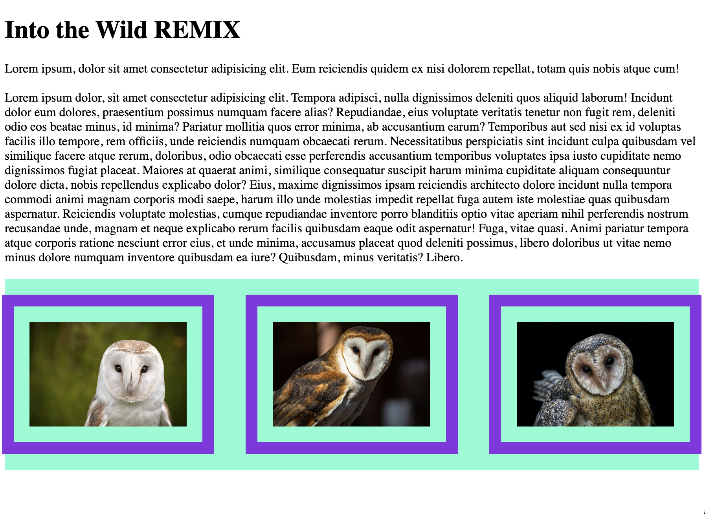

 
<!-- Dani said to copy/paste from her github readme -->
<!-- https://github.com/danicrosby/lucid-dream-journal/blob/main/README.md  -->
<!-- Use this as a template and image of our project screenshot -->

# Lucid - a dream journal

I plan to build an application that allows people to log their dreams and mood. The primary user of the application will be anyone over the age of 13, the secondary will be parents of the children under 18.

When the user logs in the the app, they will be prompted to add a new dream. When the user clicks on the "add" button they will be taken to a page where they can record their dream in detail. Once the user submit the log they will be taken to a page where they can choose from a variety of tags including objects, mood, colors that occurred in the dream they just logged. When the user clicks the "done" button, a keywords are stored and populated in a stats page where the individual is presented with documentation about what the psychology of that word means and the interpretation is stored for later use.

Personally, I want to use this to practice using React. This project will have multiple aspects but will be simple and straightforward. My goal is to have clear, clean UI and target simplicity above all things. It will reinforce the knowledge I've taken from our previous assignment and challenge me to make those challenges more efficient.

## Relevant Links

### User Story & Full CRUD Functionality

- User must create an account to access the app.
- User must sign-in and get AUTHENTICATED to view their dream cards.
- User is able CREATE and document each time they have a dream by logging into the app and tapping the add button.
- User can READ previous dreams by clicking the dream card in the history feed.
- User can EDIT dream text by clicking the edit button on the dream card.
- User can DELETE dreams by clicking the delete button on the dream card.
- User can tag dreams from a list of icons after they log text of their dream.
- User can EDIT and UPDATE tagging for a previous dream card.
- User can navigate to the education page to learn more about what their dreams mean.
- Dream data and info will be grabbed via API or coded with JSON data and keywords.
- Once dream is submitted, user can view data collected in the stats view page.

Welcome Page:

Dream Bank:

Add Dream Form: 

Add Dream Form with Functional DatePicker: 

Single Dream View and Edit Form:

Education Page with Slide-Out Menu: 

Stats Menu:

### Stretch Goals for LUCID

- [ ] For user to see web chart of mood tracked over time
- [ ] Reminders to log dream
- [ ] Made for mobile, but fully responsive design
- [ ] Able to share dreams (export) to another user

## Contributors
[Dani Crosby](https://github.com/danicrosby)